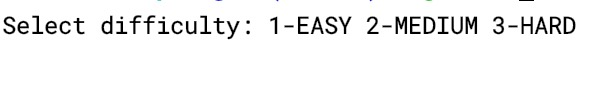
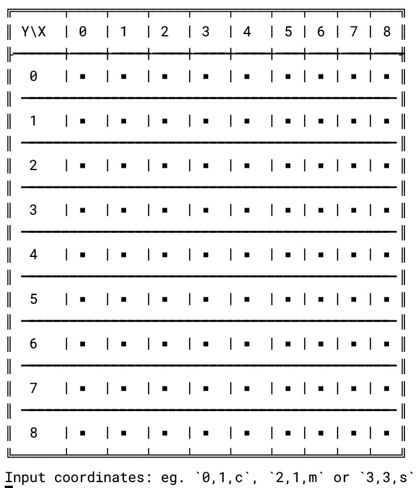
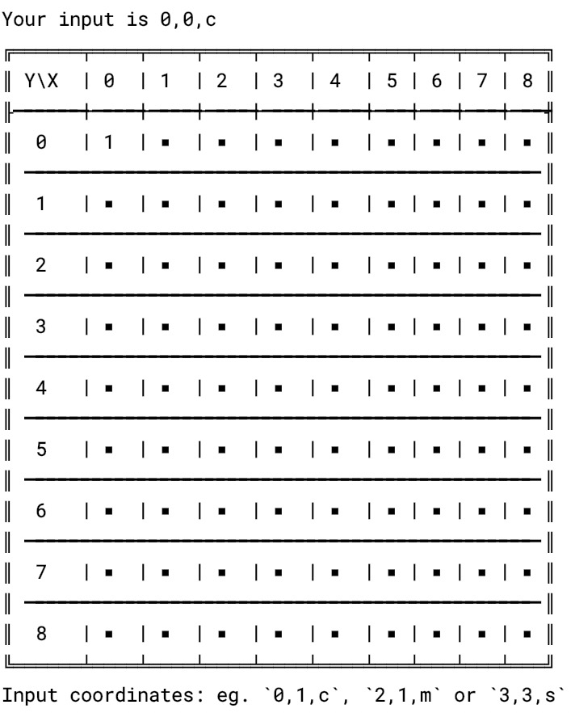

# minesweeper

**基于命令行显示的扫雷游戏**

#### 游戏特点
1. 支持选择困难度（容易，中等，困难）  
2. 最终获得分数显示  

#### 玩法介绍
1. 先选择困难度（1：容易，2：中等，3：困难）  

2. 输入执行指令，格式为 `X坐标`，`Y坐标`，`动作类型`  
其中动作类型有：  
`c`：清除方块，也就是传统 GUI 的点击某个方块  
`m`：标记为地雷方块
`s`：标记为可疑方块  
因此如果输入 `0,0,c`，代表选择坐标为 (0,0) 的方块，并清除它，  
如果输入 `1,1,m`，代表选择坐标为 (1,1) 的方块，并标记它  
  

3. 输入完指令后，会显示最新游戏画面，并提示输入下一次指令：  
  

4. 根据规则，如果清除带了地雷的方块，那么游戏结束并显示失败。如果标记完所有的地雷，那么游戏胜利

#### License
MIT License
